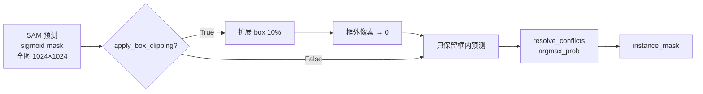

# T19 框外像素处理策略分析

**日期**: 2026-02-22  
**状态**: ✅ 已调研

---

## 当前实现

### 代码位置
[segment_with_boxes()](file:///d:/AI/paper/CellSam/src/inference/core.py#L129-L255) — `src/inference/core.py`

### 机制: Box Clipping

```python
# inference/core.py  segment_with_boxes() L204-L216
if config.apply_box_clipping:     # 默认 True
    x1, y1, x2, y2 = boxes[i]
    bw, bh = x2 - x1, y2 - y1
    expand = config.box_expand   # 默认 0.1 (10%)
    
    x1_clip = max(0, int(x1 - bw * expand))
    y1_clip = max(0, int(y1 - bh * expand))
    x2_clip = min(W, int(x2 + bw * expand))
    y2_clip = min(H, int(y2 + bh * expand))
    
    mask_clipped = torch.zeros_like(pred_sigmoid)
    mask_clipped[y1_clip:y2_clip, x1_clip:x2_clip] = pred_sigmoid[...]
    pred_sigmoid = mask_clipped
```

### 工作流程



### 关键行为

| 设置项 | 默认值 | 效果 |
|--------|--------|------|
| `apply_box_clipping` | `True` | 启用框外像素裁切 |
| `box_expand` | `0.1` | 在 box 四周扩展 10% 作为缓冲 |
| `mask_threshold` | `0.5` | sigmoid > 0.5 才被认为属于该实例 |
| `conflict_policy` | `argmax_prob` | 重叠区域取最高 sigmoid 值的实例 |

### 影响分析

1. **正面**: 防止 SAM 在远离 prompt box 区域产生伪阳性（SAM 的已知问题）
2. **正面**: 减少实例间冲突像素
3. **负面**: 如果细胞实际形态显著超出 box+10%，会丢失边缘像素
4. **iPSC-CM 特殊性**: 大面积不规则形态 → 实际细胞可能超出 DAPI nucleus 对应的 box。但 10% expand 在实践中对 Oracle (GT box) 足够覆盖

### 对比: MedSAM baseline 的处理

`baseline_eval.py` 的 `eval_medsam()` 中也使用了**相同的** `resolve_conflicts()` 和 `argmax_prob` 策略，保证公平比较。但 MedSAM 代码**没有 box clipping**（直接将全图 sigmoid 传给 resolve_conflicts）。

> [!IMPORTANT]
> **公平性差异**: MedSAM 没有 box clipping → 框外高置信像素可能被保留。这理论上有利于 MedSAM，但由于 MedSAM 用的是 GT box，GT box 已经很好地覆盖了目标，影响有限。

## 建议

- 当前策略合理，无需修改
- 论文中可在 Method 部分简述: "predictions are clipped to the expanded bounding box region (10% margin) to suppress distant false positives"
