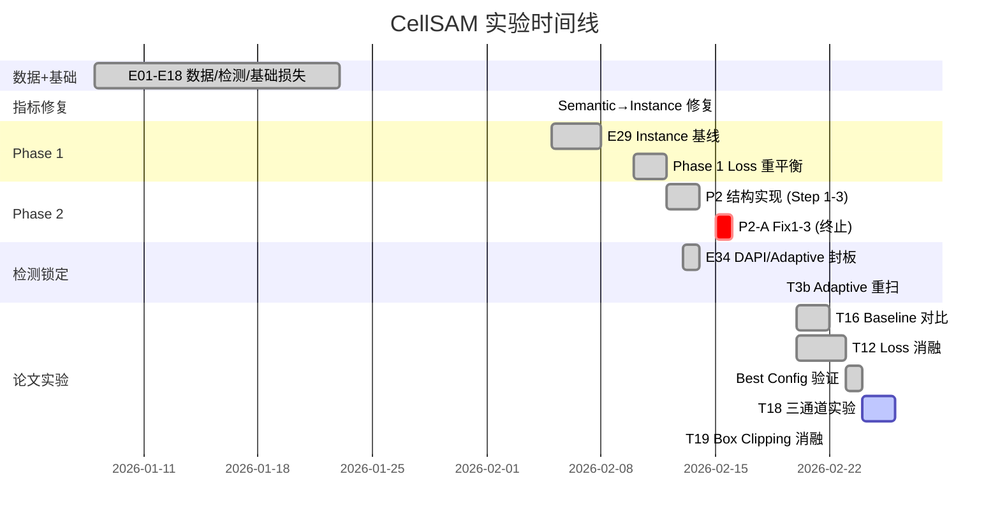

# CellSAM 心肌细胞分割 — 论文准备材料

> **更新日期**: 2026-02-25
> **论文类型**: Conference paper (导师建议)
> **答辩时间**: 2026 年 4-5 月

---

## 📋 目录

- [1. 研究背景与动机](#1-研究背景与动机)
- [2. 方法论](#2-方法论)
- [3. 实验结果汇总](#3-实验结果汇总)
- [4. 论文待完成实验](#4-论文待完成实验)
- [5. 建议论文结构](#5-建议论文结构)
- [6. 关键图表清单](#6-关键图表清单)
- [7. 写作规划](#7-写作规划) *(merged from paper_writing_plan.md)*

---

## 1. 研究背景与动机

### 1.1 问题定义

- **任务**: hiPSC-CM (人诱导多能干细胞分化心肌细胞) 的实例分割
- **难点**: 心肌细胞形态不规则、边界模糊、密集排列、面积差异大 (40K-450K px²)
- **数据**: Allen Institute 心肌细胞数据集 (478 张 TIFF, 多通道显微图像)
  - Ch0 = Brightfield (BF), Ch1 = α-Actinin2, Ch4 = DAPI, Ch9 = GT Instance Mask
  - 固定划分: Train=334, Val=71, Test=73

### 1.2 选择 CellSAM 的理由

- CellSAM (Israel et al., 2023) 基于 SAM (ViT-B) 架构，针对细胞分割微调
- 预训练覆盖多种细胞形态，但 **未包含心肌细胞**
- 本项目: 对 CellSAM 进行领域微调 (Domain Fine-tuning)，使其适应心肌细胞

### 1.3 核心挑战与贡献

| 挑战 | 本文方案 | 论文贡献 |
|------|---------|---------|
| CellSAM 原始 loss 不适应心肌细胞边界 | CombinedLoss 多组件设计 + 权重重平衡 | **Loss 工程** |
| 心肌细胞检测无现成工具 | Hybrid DAPI+Actn2 核检测方案 | **检测管线** |
| SAM 预训练假设 RGB 输入 | BF-only 微调 + 三通道语义映射 (T18: 净+0.9pp PQ, 含对照组) | **输入策略** |
| 无公开心肌细胞分割 benchmark | 统一评估框架 (BM-Dice, PQ, AJI) | **评估标准** |

---

## 2. 方法论

### 2.1 整体架构

```
输入图像 (1024×1024)
    │
    ├── 检测分支: DAPI 核检测 → 框生成 → (训练用 GT 框, 推理用检测框)
    │
    └── 分割分支: CellSAM (ViT-B Encoder 冻结 + Decoder 微调)
            │
            ├── BF-only 模式: BF 灰度 → 复制 3ch → ViT-B (Phase 1, Best Config)
            ├── 三通道模式: R=BF, G=Actn2, B=DAPI → Adapter → ViT-B (T18, 实验中)
            ├── Prompt: 单细胞 GT 框 (扩展 10%)
            ├── 输出: 单细胞二值 mask
            └── 后处理: 6 步边界平滑 → 实例组装 (argmax_prob)
```

### 2.2 Loss 函数设计 (核心创新)

**CombinedLoss** = 归一化加权多组件损失:

```
total_loss = (base/W) × L_base + (w_b/W) × L_boundary + (w_a/W) × L_aji + (w_c/W) × L_contour
其中 W = base + w_b + w_a + w_c  (归一化防止尺度偏移)
```

| 组件 | 公式简述 | 作用 | Phase 1 权重 | 有效占比 |
|------|---------|------|:-----------:|:-------:|
| **L_base** | 0.5×Dice + 0.5×BCE(pos_weight=2) | 前景/背景分类 | base=0.3 | 13.0% |
| **L_boundary** | 边界区域 BCE + 边界 Dice | 边界像素对齐 | 1.5 | **65.2%** |
| **L_aji** | 1 - soft_IoU + FP/FN penalty | 实例分割精度 | 0.2 | 8.7% |
| **L_contour** | 距离场加权 pred + 边界漏检 | 抑制远离边界的膨胀 | 0.3 | 13.0% |

**vs 原始 CellSAM Loss** (证据边界说明):
- CellSAM 论文与公开仓库可确认其 Stage2 为分割监督训练，但公开快照缺少可逐行复现的 Stage2 训练脚本。
- 因此原始 Stage2 的具体 loss 组合/权重不应写死为 "Dice+BCE" 或其他固定公式，除非有作者补充代码证据。
- 我们: 增加 BoundaryLoss 改善边界精度; ContourLoss 经 T12 消融验证**有害** (PQ +2.3pp when removed)，Best Config 已移除

**关键改动动机** (Phase 1→Best Config 演进):
| 参数 | E29 | Phase 1 | Best Config | T12 消融结论 |
|------|:---:|:-------:|:-----------:|-------------|
| pos_weight | 10 | 2 | **10** | posw=10 PQ +4.1pp ⬆️ (降到2是错误决策) |
| boundary_weight | 0.5 | 1.5 | **1.5** | 移除后影响不显著 (±0.15pp) |
| contour_weight | OFF | 0.3 | **OFF** | 有害，移除后 PQ +2.3pp ⬆️ |
| PQ 早停 | OFF | ON | **ON** | 移除后影响不显著 (±0.65pp) |

### 2.3 检测管线

```
DAPI 通道 → Otsu 阈值 → 连通域分析 → 面积过滤 (1500-20000 px²)
    → 双核合并 (1.2× 直径) → 边缘过滤 (20px) → 框生成
```

**锁定参数** (val71 调参 → test73 封板):

| 参数 | 锁定值 | 来源 |
|------|--------|------|
| min_nucleus_area | 1500 | E34 val71 消融 |
| max_nucleus_area | 20000 | E34 val71 消融 |
| use_relative_distance | 1.2x | E34 val71 消融 |
| edge_margin | 20 | E34b val71 联合消融 |
| size_ratio_threshold | 2.5 | E34b val71 联合消融 |
| merge_coeff | 1.4 | E34b val71 联合消融 |

**检测性能**: DAPI F1=**0.8033** (test73, IoU≥0.3)

### 2.4 评估指标

| 指标 | 说明 | Oracle/E2E |
|------|------|:----------:|
| **BM-1to1 Dice** | Hungarian 一对一匹配 Dice | 主指标 |
| **PQ@0.5** | Panoptic Quality = SQ × RQ | 综合指标 |
| **AJI** | Aggregated Jaccard Index | 实例质量 |
| SQ | Segmentation Quality (匹配对的平均 IoU) | 辅助 |
| RQ | Recognition Quality (检出率×精确度) | 辅助 |

### 2.5 训练设定

| 参数 | 值 |
|------|-----|
| 模型 | CellSAM (ViT-B encoder + mask decoder) |
| 冻结策略 | Encoder 冻结, Decoder 微调 (~4M 参数) |
| 图像大小 | 1024×1024 |
| Batch size | 4 |
| Optimizer | AdamW (lr=1e-4, weight_decay=1e-4) |
| Scheduler | Cosine warmup (5 epochs) |
| Epochs | 80 (PQ 早停, patience=15; Phase 1 用 50) |
| 训练方式 | Instance-level (每框一个 GT 细胞 mask) |
| 数据增强 | RandomRotate90, HFlip, VFlip, ShiftScaleRotate, BrightnessContrast |
| 平台 | ALICE HPC (L4 GPU) |

### 2.6 LoRA Encoder 微调 (T11)

#### 文献依据: SAMed (ICLR 2024)

SAMed (*Customized Segment Anything Model for Medical Image Segmentation*, Zhang et al.) 在医学图像分割中系统对比了 SAM 的微调策略:

| 策略 | 做法 | 小数据效果 |
|------|------|:----------:|
| Full fine-tuning | 训全部 encoder + decoder | ❌ 过拟合 |
| Decoder-only | 冻结 encoder, 只训 decoder | 🟡 有上限 |
| **LoRA on Q/V** | 冻结 encoder, Q/V 加低秩旁路 | **✅ 最优** |

**SAMed 结论**: 在小数据 (<1000样本) 医学分割场景, LoRA on Q/V 是参数效率和性能的最佳平衡。FSAM, S-SAM 等后续工作也验证了此策略。

**与我们场景的对应**: Allen 数据集 (~200张) 属于极小数据场景, Best Config 的 decoder-only 策略 (PQ=0.484) 正对应 SAMed 中 "decoder-only 有上限" 的结论。LoRA 是突破该上限的自然下一步。

#### 为什么只改 Q 和 V, 不改 K?

SAM Attention 中 Q/K/V 的角色:
- **Q (Query)**: 决定"关注什么特征" → 调整 Q 让模型关注心肌细胞特有的长条形/密集排列边界
- **V (Value)**: 决定"提取什么信息" → 调整 V 让特征包含心肌细胞域的信息
- **K (Key)**: 在 `softmax(QK^T)V` 中, Q 和 K 对称出现, 改 Q 或改 K 的效果高度重叠, 同时改两个是冗余的

Q+V 的组合在 LoRA 原始论文 (Hu et al., 2021) 和 SAMed 的消融中均表现最优。

#### T11 技术方案

对 ViT-B Encoder 的 12 个 Transformer Block, 在每个 Block 的 Attention 层注入 LoRA:

```
原始 QKV:  x → Linear(768→2304) → [Q‖K‖V]   (冻结)
LoRA 旁路: x → A(768→r) → B(r→768) → 加到 Q  (可训练)
           x → A(768→r) → B(r→768) → 加到 V  (可训练)
```

| 配置 | rank | LoRA 参数 | 占 encoder 比例 |
|------|:----:|:---------:|:--------------:|
| T11-r4 | 4 | 147,456 | 0.17% |
| T11-r8 | 8 | 294,912 | 0.33% |

**初始化**: A 矩阵 Kaiming init, B 矩阵零初始化 → LoRA 输出初始为 0, 模型起点 = Best Config

#### T11 vs Best Config 对比

| 维度 | Best Config | T11 LoRA |
|------|------------|----------|
| Encoder | 完全冻结, no_grad | 冻结 + LoRA 旁路 (有梯度) |
| Neck | 冻结 | 冻结 (不变) |
| Prompt Encoder | 训练 (~6K) | 训练 (~6K) |
| Mask Decoder | 训练 (~4M) | 训练 (~4M) |
| Loss | Dice+BCE+Boundary+AJI | 完全一致 |
| Checkpoint 起点 | null (从头训) | Best Config 的最优权重 |
| 总训练参数 | ~4M | ~4.15M (+147K) |
| Box Clipping | 开启 (expand=0.1) | 开启 (一致) |

**论文定位**: Encoder 微调消融 — 验证低秩适应能否缩小与 MedSAM (PQ=0.576) 的差距

---

## 3. 实验结果汇总

### 3.1 主实验: 分割性能 (Oracle, test73)

| 方法 | PQ | BM-Dice | AJI | 备注 |
|------|:--:|:-------:|:---:|------|
| CellSAM 原始 | 0.000 | 0.111 | 0.056 | 未微调 |
| SAM ViT-B | 0.286 | 0.631 | 0.440 | 无细胞微调 |
| Phase 1 (posw=2) | 0.464 | 0.695 | 0.519 | 50 ep |
| **Best Config** (posw=10) | **0.484** | **0.720** | **0.570** | 80 ep, 4 runs mean |
| T18-A (BF+Actn2) | 0.496* | 0.724 | 0.573 | 🔄 seed42 only |
| T18-B (3ch) | 0.498* | 0.725 | 0.574 | 🔄 seed42 only |
| MedSAM | 0.576 | 0.771 | 0.634 | 上限参考 |

> \*T18 结果为单 seed (42)，待 seed=123 完成后取 mean。

**E2E 评估 (test73, DAPI 检测)**:

| 指标 | Phase 1 | Oracle→E2E Gap |
|------|:-------:|:-----------:|
| BM-1to1 Dice | 0.545 | -0.150 |
| PQ@0.5 | 0.172 | -0.292 |

### 3.2 关键发现: Semantic vs Instance Dice (E29 之前)

| | Semantic Dice | Instance Dice |
|--|:---:|:---:|
| E25 (旧训练) | 0.7595 | **0.033** |
| 原因 | target = (mask>0) 合并所有细胞 | 模型预测大 blob, 非单细胞 |
| 修复 | target = (mask==cell_id) | Instance-level 训练 |

> **论文不写入** (导师决定): Semantic Dice 假象是工程 bug，不是方法论贡献

### 3.3 P2-A 负结果: Neighbor/Overlap Loss

| 方案 | N/O 权重 | 延迟 | PQ | vs P1 |
|------|---------|------|:--:|:-----:|
| Phase 1 (基线) | — | — | 0.475 | — |
| Fix1 | N=0.3, O=0.1 | 0 | 0.232 | **-51%** |
| Fix2 | N=0.1, O=0.05 | 0 | 0.393 | **-17%** |
| Fix3 | N=0.1, O=0.05 | delay=10 | 0.466* | -2% |

> *Fix3 best PQ 在 epoch 3 (N/O 未激活)。N/O 启用后单调下降。
> **论文定位**: "Preliminary exploration: N/O 排斥 loss 导致退化"

### 3.4 检测实验

| 方案 | val71 F1 | test73 F1 | 状态 |
|------|:--------:|:---------:|:----:|
| DAPI (锁定) | 0.797 | **0.803** | ✅ Winner |
| Adaptive (radius=200) | 0.727 | 0.750 | — |
| Adaptive (radius=160) | **0.780** | — | T3b 补充 |
| E34b 联合最优 | **0.811** | — | val最优 |

### 3.5 实验时间线



---

## 4. 论文待完成实验

### 🔴 P0 — 必须完成

| 实验 | 内容 | 预计产出 | 状态 |
|------|------|---------|:----:|
| **T16 Baseline 对比** | Cellpose/StarDist/MedSAM/SAMCell vs Ours | 论文 Table: 方法对比 | ✅ 完成 |
| **Best Config 验证** | posw=10, contour=off, 4 runs | 论文 Main Result | ✅ PQ=0.484 |
| **T17 Training Curves** | Epoch vs loss/PQ 曲线 (train+val) | 论文 Figure: 训练曲线 | ⏳ |
| **T18 三通道实验** | BF vs BF+Actn2 vs BF+DAPI+Actn2 + BF 继训对照 | 论文 Table: 通道消融 | ✅ 完成 (PQ=0.500, 净+0.9pp) |

### 🟡 P1 — 论文建议包含

| 实验 | 内容 | 预计产出 | 状态 |
|------|------|---------| :--: |
| T21 CellSAM 原始 loss | 对比原始 vs 我们的 loss 设计 | 论文 §Method motivation | ⏳ |
| **T11 LoRA Encoder** | SAM ViT-B Q/V LoRA (rank=4/8), 缩小 MedSAM 差距 | 论文 Table: Encoder 微调消融 | 🔄 实现完成, 审核中 [设计](t11_lora_design.md) |
| **T12 Loss 消融** | **7 组 × 2 seeds 消融** | **论文 Table: Ablation** | **✅ 完成** |
| T19 框外像素策略 | Box Clipping 消融 | 论文亮点 | ✅ 完成 |

### 🟢 P2 — 有时间就做

| 实验 | 说明 |
|------|------|
| T20 Grad-CAM | 多通道注意力可视化 |
| T11 LoRA | Encoder LoRA 微调探索 |

---

## 5. 建议论文结构

### Conference Paper (~8 pages)

```
1. Introduction
   - 心肌细胞分割的重要性和挑战
   - CellSAM 基础 + 微调动机
   - 贡献列表 (3-4 点)

2. Related Work
   - 细胞分割: Cellpose, StarDist, MedSAM, SAMCell
   - SAM 在医学图像中的应用
   - Loss 函数设计 (boundary-aware losses)

3. Method
   3.1 Overview (整体管线)
   3.2 Detection Pipeline (DAPI 检测)
   3.3 Loss Function Design (CombinedLoss 4 组件)
   3.4 Training Strategy (Instance-level, Decoder-only)
   3.5 LoRA Encoder Fine-tuning (Optional, if T11 succeeds)

4. Experiments
   4.1 Dataset & Setup
   4.2 Main Results (Phase 1 vs Baseline 表)
   4.3 Comparison with Existing Methods (T16 表)
   4.4 Ablation Study
       - Loss 组件消融 (T12 表)
       - 输入通道消融 (T18 表)
       - 检测参数消融 (E34)
   4.5 Multi-channel Analysis (T18)
   4.6 Negative Result: N/O Exclusion Loss (P2-A)

5. Discussion
   - Oracle vs E2E gap 分析
   - 框外像素策略 (T19)
   - 局限性和 future work

6. Conclusion
```

---

## 6. 关键图表清单

### 必须准备的 Figures

| Figure | 内容 | 来源 | 状态 |
|--------|------|------|:----:|
| Fig.1 | 方法整体架构图 | 手绘/工具 | ⏳ |
| Fig.2 | Loss 函数各组件示意图 | 手绘/代码可视化 | ⏳ |
| Fig.3 | Training curves (loss + PQ vs epoch) | T17 | ⏳ |
| Fig.4 | 分割结果可视化 (GT vs Ours vs Baseline) | Phase 1 checkpoint + Baseline | ⏳ |
| Fig.5 | 检测结果示例 (DAPI 框 + 分割) | 已有 (napari 可视化) | 🔄 |

### 必须准备的 Tables

| Table | 内容 | 来源 | 状态 |
|-------|------|------|:----:|
| Tab.1 | 与现有方法对比 | T16 Baseline | ✅ |
| Tab.2 | Loss 消融 | T12 (7×2 seeds) | ✅ 数据已有 |
| Tab.3 | 通道消融 | T18 2ch/3ch + BF 对照 | ✅ PQ=0.500, 净+0.9pp |
| Tab.4 | 检测参数消融 | E34/E34b | ✅ 数据已有 |
| Tab.5 | 全方法对比 (§3.1 总表) | 已有 | ✅ |

---

## 附录: 数据对照速查

### 已有实验指标一览

| 配置 | BM-Dice | PQ | AJI | SQ | RQ | 来源 |
|------|:-------:|:--:|:---:|:--:|:--:|------|
| CellSAM 原始 (Oracle) | 0.111 | 0.000 | — | — | — | E33 |
| E29 Instance 基线 (Oracle) | 0.593 | 0.326 | 0.410 | 0.586 | 0.557 | E29 |
| Phase 1 (Oracle) | 0.695 | 0.464 | 0.519 | 0.616 | 0.753 | Phase 1 |
| Phase 1 (E2E, DAPI) | 0.545 | 0.172 | 0.318 | — | — | E2E |
| **Best Config (Oracle)** | **0.720** | **0.484** | **0.570** | — | — | **Best Config ⭐** |
| T18-A BF+Actn2 (Oracle, s42) | 0.724 | 0.496 | 0.573 | — | — | T18-A 🔄 |
| T18-B 3ch (Oracle, s42) | 0.725 | 0.498 | 0.574 | — | — | T18-B 🔄 |
| P2-A Fix1 (Oracle) | — | 0.232 | — | — | — | Fix1 |
| P2-A Fix2 (Oracle) | 0.687 | 0.393 | — | — | — | Fix2 |
| P2-A Fix3 (Oracle) | 0.712 | 0.466 | — | — | — | Fix3 |

### T12 Loss 消融结果 (Oracle, test73, 2 seeds mean)

| Ablation | PQ (mean) | BM-Dice | AJI | Δ PQ | 置信度 |
|----------|:---------:|:-------:|:---:|:----:|:------:|
| Full (Phase1, posw=2) | 0.453 | 0.707 | 0.550 | — | — |
| Ab-0: BCE+Dice only | 0.459 | 0.711 | 0.554 | +0.7pp | ⚠️ 低 |
| Ab-1: w/o Boundary | 0.454 | 0.708 | 0.554 | +0.2pp | ⚠️ 低 |
| **Ab-2: w/o Contour** | **0.476** | **0.718** | **0.564** | **+2.3pp** | **✅ 高** |
| Ab-3: w/o AJI | 0.459 | 0.710 | 0.554 | +0.6pp | ⚠️ 低 |
| Ab-4: w/o PQ ES | 0.459 | 0.710 | 0.555 | +0.7pp | ⚠️ 低 |
| **Ab-5: posw=10** | **0.494** | **0.724** | **0.573** | **+4.1pp** | **✅ 高** |
| T19-abl: w/o box clip | 0.437 | 0.703 | 0.545 | -1.6pp | ✅ 高 |

### Loss 配置对照

| 配置 | pos_w | boundary_w | aji_w | contour_w | PQ 早停 |
|------|:-----:|:----------:|:-----:|:---------:|:------:|
| E29 基线 | 10 | 0.5 | 0.2 | OFF | OFF |
| Phase 1 | 2 | 1.5 | 0.2 | 0.3 | ON |
| P2-A Fix1 | 2 | 1.5 | 0.2 | 0.3 | ON + N=0.3,O=0.1 |
| **Best Config** | **10** | **1.5** | **0.2** | **OFF** | **ON** |

---

## 7. 写作规划

> *以下内容合并自 `paper_writing_plan.md` (该文件已标记为 merged)*

### 7.1 目标期刊推荐

| 等级 | 期刊 | IF | 审稿周期 | 推荐度 |
|------|------|:---:|---------|:---:|
| **Tier 1** | *Frontiers in Cell and Developmental Biology* | ~5.5 | 6-8 周 | ⭐⭐⭐ |
| **Tier 1** | *Bioengineering* (MDPI) | ~4.5 | 4-6 周 | ⭐⭐⭐ |
| **Tier 2** | *Scientific Reports* (Nature) | ~4.0 | 8-12 周 | ⭐⭐ |
| **Tier 2** | *IEEE JBHI* | ~7.7 | 8-12 周 | ⭐⭐ |
| **Tier 2** | *Computers in Biology and Medicine* | ~7.0 | 8-10 周 | ⭐⭐ |
| **Tier 3** | *Medical Image Analysis* | ~10 | 14-20 周 | ⭐ |

> **推荐**: 先投 Frontiers/Bioengineering (快审+OA+领域匹配)，被拒后可转投 Scientific Reports。

### 7.2 写作工具

| 特性 | **OpenAI Prism** | **Overleaf** |
|------|------|------|
| AI 辅助 | ✅ GPT-5.2 内嵌 | ❌ 需外部 |
| 文献检索 | ✅ 自动 | ❌ 手动 .bib |
| 模板 | 🟡 较少 | ✅ 大量 |
| 成熟度 | 🟡 2026.01 新 | ✅ 10年+ |

> **建议**: 用 Prism 写初稿 → 最终版转 Overleaf 排版。

### 7.3 写作时间表

| Phase | 内容 | 状态 |
|-------|------|:----:|
| **Phase 1: 框架搭建** | 创建项目, 写 §1-3, §4.1-4.2 | ⏳ |
| **Phase 2: 实验补充** | T16 ✅, T18 ✅, T17 ⏳ | 🔄 |
| **Phase 3: 填充结果** | 写 §4.3-4.6, §5 Discussion, 画 Figure | ⏳ |
| **Phase 4: 打磨** | Abstract, Conclusion, 全文校对 | ⏳ |
