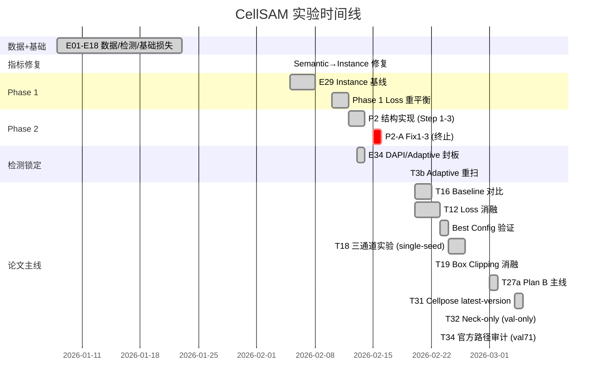

# CellSAM 心肌细胞分割 — 论文准备材料


> Current writing-status audit: `docs/paper_writing/communication/paper_writing_audit_2026-03-11.md`
> Current alignment plan: `docs/paper_writing/t27a_official_alignment_plan.md`
> Current baseline/mouse review: `docs/experiments/active/baseline_models_and_mouse_transfer_review_2026-03-11.md`
> Current hybrid-detector plan: `docs/experiments/active/hybrid_detector_noisy_box_training_plan.md`
> Current execution matrix: `docs/experiments/active/hybrid_detector_noisy_box_execution_matrix_2026-03-12.md`
> Current method-value narrative: `docs/paper_writing/communication/method_value_narrative_2026-03-12.md`
> Current figure plan: `docs/paper_writing/communication/figure_plan_2026-03-17.md`

> **更新日期**: 2026-03-08
> **论文类型**: 硕士论文 (Master's Thesis, 20-50 pages)
> **答辩时间**: 2026 年 4-5 月

---

## 📋 目录

- [0. 写作口径说明](#0-写作口径说明)
- [1. 研究背景与动机](#1-研究背景与动机)
- [2. 方法论](#2-方法论)
  - [2.7 CellSAM Methods 一页证据表](#27-cellsam-methods-一页证据表)
- [3. 实验结果汇总](#3-实验结果汇总)
- [4. 论文待完成实验](#4-论文待完成实验)
- [5. 建议论文结构](#5-建议论文结构)
- [6. 关键图表清单](#6-关键图表清单)
- [7. 写作规划](#7-写作规划) *(merged from paper_writing_plan.md)*
- [8. 技术口径索引](#8-技术口径索引)

---

## 0. 写作口径说明

- **正式正文主线**: 锁定 `test73` 分割证据（当前保留 T27a 锁定参考）+ `T31` (`test73` Cellpose v4.0.1 baseline) + `T34` (`val71` 路径审计, 暂非最终 test 结论); detector-driven 集成分支当前选用 `T28` 作为分割后端
- **split 必须显式标注**: `val71` 与 `test73` 不得在同一主表中无标注混排
- **当前仅可作审计证据的结果**: `T34` 目前只有 `val71`, 可用于讨论 unified vs official path, 不能写成最终 `test73` 结论
- **需标 provisional 的结果**: `T18` 当前仍是 single-seed 结果, 当前决定仅保留在 `Appendix B`; 若要回升正文必须补第二个 seed
- **历史结果的定位**: `Phase 1` / `Best Config` / `T11` 保留为内部演进或附录证据, 不再作为当前论文主结果

---

## 1. 研究背景与动机

### 1.1 问题定义

- **任务**: hiPSC-CM (人诱导多能干细胞分化心肌细胞) 的实例分割
- **难点**: 心肌细胞形态不规则、边界模糊、密集排列、面积差异大 (40K-450K px²)
- **数据**: Allen Institute 心肌细胞数据集 (478 张 TIFF, 多通道显微图像)
  - Ch0 = Brightfield (BF), Ch1 = α-Actinin2, Ch4 = DAPI, Ch9 = GT Instance Mask
  - 固定划分: Train=334, Val=71, Test=73

### 1.2 选择 CellSAM 的理由

- CellSAM (Israel et al., 2023) 基于 SAM (ViT-B) 架构，针对细胞分割微调
- 预训练覆盖多种细胞形态，但 **未包含心肌细胞**
- 本项目: 对 CellSAM 进行领域微调 (Domain Fine-tuning)，使其适应心肌细胞

### 1.3 核心挑战与贡献

| 挑战 | 本文方案 | 论文贡献 |
|------|---------|---------|
| CellSAM 原始 loss 不适应心肌细胞边界 | CombinedLoss 多组件设计 + Focal + IoU Head | **Loss 工程** |
| 心肌细胞检测无现成工具 | Hybrid DAPI+Actn2 核检测方案 | **检测管线** |
| SAM 预训练假设 RGB 输入 | BF-only 微调 + 三通道语义映射 | **输入策略** |
| CellSAM 模型路径与论文描述不一致 | 权重审计 + model_cp 迁移 + 官方管线对齐 | **模型路径审计** |
| 无公开心肌细胞分割 benchmark | 统一评估框架 (BM-Dice, PQ, AJI) | **评估标准** |

进一步收敛后，正文里更值得强调的 3 个方法学贡献点是：

1. **Domain-aware input handling**
   - 面向复杂显微通道而不是默认 RGB 假设，系统比较 `BF-only`、官方语义编码、以及多通道映射策略。
2. **Prompt-quality-aware fine-tuning**
   - 不只优化 mask loss，而是显式面对 “GT 框训练 / noisy 框部署” 的 prompt distribution gap，把分割微调从 Oracle 设定推进到更接近真实 E2E 部署的设定。
3. **Biology-prior + foundation segmentation integration**
   - 结合 `DAPI` 核先验、`Actn2` 结构信号与 foundation model 分割能力，形成适合心肌细胞这类粘连、异形、边界弱场景的混合检测-分割框架。

---

## 2. 方法论

### 2.1 整体架构

```
输入图像 (1024×1024)
    │
    ├── 检测分支: DAPI 核检测 → 框生成 → (训练用 GT 框, 推理用检测框)
    │
    └── 分割分支: CellSAM (ViT-B Encoder 冻结 + Decoder 微调)
            │
            ├── BF-only 主线: BF 灰度 → 复制 3ch → model_cp 分支 (T27a, 当前主线)
            ├── 三通道探索: R=BF, G=Actn2, B=DAPI → Adapter → ViT-B (T18, provisional)
            ├── Prompt: 单细胞 GT 框 (扩展 10%)
            └── 输出: 单细胞二值 mask → 实例组装
```

### 2.1b CellSAM 模型架构与冻结策略分析

**CellSAM (公开发布 checkpoint) 结构**: 基于 SAM ViT-B, 在对象层面包含 3 个主要模块:

| 模块 | 结构 | 参数量 (约) | 当前可证结论 |
|------|------|:---------:|------|
| `model` (SAM 分支 A) | image_encoder (ViT + neck) + prompt_encoder + mask_decoder | ~89M | 与 CellFinder backbone 的非-neck部分对齐 |
| `model_cp` (SAM 分支 B) | 同上 (初始化时 deepcopy, 发布 checkpoint 中为独立权重分支) | ~89M | **官方分割推理默认走这一路** |
| `cellfinder` (AnchorDETR) | SAMBackbone + AnchorDETR transformer decoder + bbox postprocess | ~20M | 官方检测分支 |

> [!NOTE]
> `model` / `model_cp` / `cellfinder` 不是 3 个独立权重文件, 而是同一个官方 checkpoint (`cellsam_general.pt`) 内部的 3 组 state_dict 前缀。

**对象关系与本地实测**:

| 对比对象 | same | diff | 结论 |
|------|:----:|:----:|------|
| `cellfinder.decode_head.backbone.body` vs `model.image_encoder` 去 neck | 171 | 0 | **完全一致** |
| `cellfinder.decode_head.backbone.body` vs `model_cp.image_encoder` 去 neck | 0 | 171 | **完全不同** |
| `model.image_encoder` 去 neck vs `model_cp.image_encoder` 去 neck | 0 | 171 | **完全不同** |
| `model` 全分支 vs `model_cp` 全分支 | 0 | 314 | **两个 SAM 分支全局不同** |

**当前应采用的解释**:

1. 发布代码对象层面, 检测和分割**不是共享同一个 Python `image_encoder` 实例**
2. `cellfinder` 里的 `SAMBackbone` 由 `ModifiedImageEncoderViT` 构成, 只保留:
   - `patch_embed`
   - `pos_embed`
   - `blocks`
   不包含 neck
3. 权重层面, `cellfinder backbone` 对齐的是 `model` 分支的非-neck部分
4. 官方分割推理默认走 `model_cp`

> [!NOTE]
> 因此, 不应再把公开发布 checkpoint 简单解释成“`model_cp` = 在 `model` 上只改 neck 得到的纯 Stage 2 结果”。

### 2.1c CellFinder 调用链与“共享 backbone”源码结构图

论文写法里的“共享 backbone”更接近**功能层共享**，不是发布代码里“共享同一个 Python 实例对象”。

#### 源码调用链

```text
CellSAM
  -> self.cellfinder = CellfinderAnchorDetr(config)
      -> decode_head = AnchorDETR(...)
          -> backbone = SAMBackbone(...)
              -> sam_model_registry['vit_b']()
              -> .image_encoder
              -> ModifiedImageEncoderViT(
                     patch_embed
                     pos_embed
                     blocks
                 )
```

对应源码:

- `cellSAM_source/cellSAM/sam_inference.py:134`
- `cellSAM_source/cellSAM/AnchorDETR/models/anchor_detr.py:412`
- `cellSAM_source/cellSAM/AnchorDETR/models/backbone.py:219`
- `cellSAM_source/cellSAM/AnchorDETR/models/backbone.py:180`

#### 对象层结构图

```text
CellSAM
  ├─ model
  │   └─ image_encoder (ViT + neck)
  ├─ model_cp
  │   └─ image_encoder (ViT + neck)
  └─ cellfinder
      └─ decode_head.backbone.body
          └─ ModifiedImageEncoderViT
              = patch_embed + pos_embed + ViT blocks
              = model 分支 backbone 主体
              ≠ model_cp 分支 backbone 主体
```

#### 本地实测结论

| 对比 | same | diff | 结论 |
|------|:----:|:----:|------|
| `cellfinder.decode_head.backbone.body` vs `model.image_encoder` 去 neck | 171 | 0 | 完全一致 |
| `cellfinder.decode_head.backbone.body` vs `model_cp.image_encoder` 去 neck | 0 | 171 | 完全不同 |
| `model.image_encoder` 去 neck vs `model_cp.image_encoder` 去 neck | 0 | 171 | 完全不同 |

因此论文里更严谨的表述应是:

> 发布 checkpoint 中，CellFinder 的 SAMBackbone 与 `model` 分支的 ViT 主体对齐；分割推理则走 `model_cp` 分支。所谓“共享 backbone”应理解为功能层共享同类 ViT 表征，而不是代码对象层共享同一个 encoder 实例。

### 2.1d 论文两阶段描述 vs 发布 checkpoint 事实

CellSAM 论文的训练描述是:

1. **Stage 1**: 训练 ViT backbone + CellFinder 做检测
2. **Stage 2**: 冻结 ViT encoder 和 SAM mask decoder, 微调 neck 做分割适配

但对**公开发布 checkpoint** 的代码级核查结果是:

1. `model` 与 `model_cp` 的 encoder 非-neck部分 **171/171 全不同**
2. neck **6/6 全不同**
3. mask decoder **120/120 全不同**
4. prompt encoder **17/17 全不同**

这意味着:

> 论文描述的是两阶段训练策略; 但公开 checkpoint 并没有以“只差 neck 的 stage1/stage2 成对分支”形式保留下来。

当前最安全的写法应是:

> **在本项目中, 将 `model_cp` 视为官方分割推理分支, 将 `model` 视为与 CellFinder backbone 对齐的另一套 SAM 分支, 而不对两者差异做超出公开代码证据的强推断。**

关于“为什么连 prompt encoder / mask decoder 也全变了”, 目前**只能确认事实, 不能确认原因**。公开仓库没有 Stage 2 训练脚本, 因此以下都不能写成定论:

1. 不能定论 `model_cp` 是直接从 `model` 继续训练得到
2. 不能定论发布 checkpoint 保留了训练中的中间态语义
3. 不能定论作者是否在发布版中做过额外重打包 / 分支重置 / 推理专用导出

因此论文中应写成:

> **公开代码可证的是“发布 checkpoint 中 `model` / `model_cp` 全局不同”; 不可证的是“它们为什么不同到 prompt encoder 和 mask decoder”。**

**Prompt Encoder 结构 (SAM 原始)**:

Prompt Encoder 的 box→embedding 过程是纯位置编码 + 查表, **无复杂网络**:
1. Box `[x1,y1,x2,y2]` → 拆成 2 个角点坐标
2. 坐标归一化到 `[0,1]` → 乘以随机高斯矩阵 → `sin/cos` 正弦编码 → 256 维向量
3. 加上学到的"角色" Embedding (左上角 token / 右下角 token, 各 256 维)
4. 核心编码矩阵 `positional_encoding_gaussian_matrix` 是 `register_buffer` → **不参与梯度计算**
5. Box prompt 实际可训练参数仅 **512 个** (2 × Embedding(1,256))

**Prompt Encoder 微调价值** (文献共识: 冻结即可):
- **FSAM** (IEEE, 2024): 冻结 prompt encoder, 只微调 encoder + decoder
- **ProMISe** (arXiv, 2024): 冻结全部 SAM 参数, 通过外部模块适配
- **Sam2Rad** (NIH/PMC, 2024): 冻结全部 SAM 模块, 避免 "feature damage"
- **MedSAM** (Nature Communications, 2024): 冻结 image encoder + prompt encoder, 只微调 decoder
- **本项目当前主线 (T27a)**: prompt encoder 冻结；早期实验曾默认随 decoder 一起训练，但这不是当前论文主线

### 2.2 Loss 函数设计 (当前主线: T27a)

当前论文主线 `T27a` 的训练目标由两部分组成:

```
L_total = L_combined + λ_iou · L_iou
其中 λ_iou = 0.1
```

其中 `L_combined` 为归一化加权多组件损失:

```
L_combined =
  (0.3 / W) · L_base +
  (0.3 / W) · L_boundary +
  (0.2 / W) · L_aji +
  (0.3 / W) · L_focal

W = 0.3 + 0.3 + 0.2 + 0.3 = 1.1
L_base = 0.5 · Dice + 0.5 · BCE(pos_weight=10)
```

| 组件 | 当前 T27a 配置 | 作用 | 归一化占比 |
|------|---------------|------|:----------:|
| **L_base** | Dice + BCE (`pos_weight=10`) | 前景/背景分类 | 27.3% |
| **L_boundary** | ON, `boundary_weight=0.3` | 边界像素对齐 | 27.3% |
| **L_aji** | ON, `aji_weight=0.2` | 实例级重叠质量 | 18.2% |
| **L_focal** | ON, `focal_weight=0.3`, `alpha=0.25`, `gamma=2.0` | 强化 hard pixels | 27.3% |
| `L_contour` | OFF | 历史尝试, 当前主线禁用 | 0 |
| `L_topology`, `L_size` | OFF | 备用项, 当前未启用 | 0 |
| **L_iou** | `MSE(iou_pred, actual_iou)` | 约束 IoU head 质量预测 | **在 `CombinedLoss` 外单独加权** |

**vs 原始 CellSAM Loss** (证据边界说明):
- CellSAM 论文与公开仓库可确认其 Stage2 为分割监督训练，但公开快照缺少可逐行复现的 Stage2 训练脚本。
- 因此原始 Stage2 的具体 loss 组合/权重不应写死为 "Dice+BCE" 或其他固定公式，除非有作者补充代码证据。
- 我们当前可证据化的写法是: `T27a` 使用 `Dice+BCE + Boundary + AJI + Focal` 的 `CombinedLoss`，并在训练循环中额外加入 `IoU Head MSE`

**从历史主线到当前主线的演进**:

| 阶段 | `pos_weight` | `boundary` | `aji` | `contour` | `focal` | `IoU head` | 论文定位 |
|------|:------------:|:----------:|:-----:|:---------:|:-------:|:----------:|----------|
| Phase 1 | 2 | 1.5 | 0.2 | 0.3 | OFF | OFF | 历史基线 |
| Best Config | 10 | 1.5 | 0.2 | OFF | OFF | OFF | T12 后的历史最佳配置 |
| **T27a** | **10** | **0.3** | **0.2** | **OFF** | **ON (0.3)** | **ON (0.1, external)** | **当前论文主线** |

> 写作建议: 正文方法部分应以 `T27a current training loss` 为主口径; `Phase 1` / `Best Config` 更适合作为方法演进或附录表。

### 2.3 检测管线

```
DAPI 通道 → Otsu 阈值 → 连通域分析 → 面积过滤 (1500-20000 px²)
    → 双核合并 (1.2× 直径) → 边缘过滤 (20px) → 框生成
```

**锁定参数** (val71 调参 → test73 封板):

| 参数 | 锁定值 | 来源 |
|------|--------|------|
| min_nucleus_area | 1500 | E34 val71 消融 |
| max_nucleus_area | 20000 | E34 val71 消融 |
| use_relative_distance | 1.2x | E34 val71 消融 |
| edge_margin | 20 | E34b val71 联合消融 |
| size_ratio_threshold | 2.5 | E34b val71 联合消融 |
| merge_coeff | 1.4 | E34b val71 联合消融 |

**检测性能**: DAPI F1=**0.8033** (test73, IoU≥0.3)

### 2.4 评估指标

| 指标 | 说明 | Oracle/E2E |
|------|------|:----------:|
| **BM-1to1 Dice** | Hungarian 一对一匹配 Dice | 主指标 |
| **PQ@0.5** | Panoptic Quality = SQ × RQ | 综合指标 |
| **AJI** | Aggregated Jaccard Index | 实例质量 |
| SQ | Segmentation Quality (匹配对的平均 IoU) | 辅助 |
| RQ | Recognition Quality (检出率×精确度) | 辅助 |

> 注: 在使用同一 `TP/FP/FN` 定义时，`RQ` 与 `F1` 数学上等价；但本项目部分脚本同时输出 `per-image mean RQ` 与 `global micro-F1`，若两者同时出现，正文必须显式标注聚合方式。

### 2.5 训练设定

| 参数 | 值 |
|------|-----|
| 当前主线模型 | CellSAM `model_cp` 分支 |
| 冻结策略 | image encoder + prompt encoder 冻结, mask decoder 微调 |
| 输入 | BF-only `[BF, BF, BF]` |
| 图像大小 | 1024×1024 |
| Batch size | 4 |
| Optimizer | AdamW (lr=1e-4, weight_decay=1e-4) |
| Scheduler | Cosine warmup (5 epochs) |
| Epochs | 80 (PQ 早停, patience=15) |
| 训练方式 | Instance-level (每框一个 GT 细胞 mask) |
| Loss | `CombinedLoss + IoU Head MSE (λ_iou=0.1)` |
| 数据增强 | RandomRotate90, HFlip, VFlip, ShiftScaleRotate, BrightnessContrast |
| 平台 | ALICE HPC (L4 GPU), 本地负责评估 |

### 2.6 LoRA Encoder 微调 (T11)

> 说明: 本节记录 `T11` 的历史 LoRA 探索。当前正式主线仍是 `T27a` decoder-only；若正文篇幅有限，LoRA 可下放至附录或 future work。

#### 文献依据: SAMed (ICLR 2024)

SAMed (*Customized Segment Anything Model for Medical Image Segmentation*, Zhang et al.) 在医学图像分割中系统对比了 SAM 的微调策略:

| 策略 | 做法 | 小数据效果 |
|------|------|:----------:|
| Full fine-tuning | 训全部 encoder + decoder | ❌ 过拟合 |
| Decoder-only | 冻结 encoder, 只训 decoder | 🟡 有上限 |
| **LoRA on Q/V** | 冻结 encoder, Q/V 加低秩旁路 | **✅ 最优** |

**SAMed 结论**: 在小数据 (<1000样本) 医学分割场景, LoRA on Q/V 是参数效率和性能的最佳平衡。FSAM, S-SAM 等后续工作也验证了此策略。

**与我们场景的对应**: Allen train split 仅 334 张图像, 仍属于小数据场景。T11 的设计初衷是验证 decoder-only 历史基线之上是否还能通过低秩适配继续提升。

#### 为什么只改 Q 和 V, 不改 K?

SAM Attention 中 Q/K/V 的角色:
- **Q (Query)**: 决定"关注什么特征" → 调整 Q 让模型关注心肌细胞特有的长条形/密集排列边界
- **V (Value)**: 决定"提取什么信息" → 调整 V 让特征包含心肌细胞域的信息
- **K (Key)**: 在 `softmax(QK^T)V` 中, Q 和 K 对称出现, 改 Q 或改 K 的效果高度重叠, 同时改两个是冗余的

Q+V 的组合在 LoRA 原始论文 (Hu et al., 2021) 和 SAMed 的消融中均表现最优。

#### T11 技术方案

对 ViT-B Encoder 的 12 个 Transformer Block, 在每个 Block 的 Attention 层注入 LoRA:

```
原始 QKV:  x → Linear(768→2304) → [Q‖K‖V]   (冻结)
LoRA 旁路: x → A(768→r) → B(r→768) → 加到 Q  (可训练)
           x → A(768→r) → B(r→768) → 加到 V  (可训练)
```

| 配置 | rank | LoRA 参数 | 占 encoder 比例 |
|------|:----:|:---------:|:--------------:|
| T11-r4 | 4 | 147,456 | 0.17% |
| T11-r8 | 8 | 294,912 | 0.33% |

**初始化**: A 矩阵 Kaiming init, B 矩阵零初始化 → LoRA 输出初始为 0, 模型起点 = Best Config (历史 decoder-only baseline)

#### T11 vs Best Config 对比 (历史对照)

| 维度 | Best Config | T11 LoRA |
|------|------------|----------|
| Encoder | 完全冻结, no_grad | 冻结 + LoRA 旁路 (有梯度) |
| Neck | 冻结 | 冻结 (不变) |
| Prompt Encoder | 训练 (~6K) | 训练 (~6K) |
| Mask Decoder | 训练 (~4M) | 训练 (~4M) |
| Loss | Dice+BCE+Boundary+AJI | 完全一致 |
| Checkpoint 起点 | null (从头训) | Best Config 的最优权重 |
| 总训练参数 | ~4M | ~4.15M (+147K) |
| Box Clipping | 开启 (expand=0.1) | 开启 (一致) |

**论文定位**: Encoder 微调消融 — 验证低秩适应能否缩小与 MedSAM (PQ=0.576) 的差距

### 2.7 CellSAM Methods 一页证据表

> 来源: `docs/technical/cellsam_methods_1page_table.md`  
> 证据范围: Nature Methods 论文 (`docs/Cellsam-nature.pdf`) + 公开代码可验证项。

| 阶段 | 训练目标 | 训练模块 | 冻结模块 | Loss（可证据化口径） | 关键超参 | 主要指标 | 证据页码/代码 |
|---|---|---|---|---|---|---|---|
| Stage 1 (Detection) | 学到细胞检测能力（GT mask -> GT box） | CellFinder + SAM image encoder (ViT) | SAM mask decoder | 检测损失：分类 + 框回归 + 几何（公开实现对应 Focal CE + L1 + GIoU） | AdamW；CellFinder lr=`1e-4`；SAM-ViT backbone lr=`1e-5`；wd=`1e-4`；clip norm=`0.1`；step scheduler（1960 epoch 后降 10x）；2800 epochs；batch=4；8x H100 | COCO `mAP`、`AP50`（IoU 0.5:0.95，step 0.05；max detections=10,000） | Paper p3, p10, p11；`AnchorDETR/models/anchor_detr.py` (`loss_ce/loss_bbox/loss_giou`) |
| Stage 2 (Seg alignment) | 在 GT boxes + segmentation labels 监督下对齐分割分支 | model neck（仅 neck 微调） | SAM-ViT + mask decoder | 论文写法为 segmentation supervision fine-tuning neck；公开仓库无可逐行复现的 Stage2 loss 公式/权重 | AdamW；lr=`1e-4`；wd=`1e-4`；不做 gradient clipping；50 epochs + cosine lr schedule | 分割主比较口径 `F1 error (1-F1)`；并给 Recall/Precision/F1 | Paper p3, p10, p11 |
| Benchmark reporting | 统一比较 CellSAM 与 baselines | 检测与分割分开报告 | - | 检测侧看 COCO；分割侧主文强调 `1-F1` | - | `1-F1` + Recall/Precision/F1 | Paper p3-4, p11 |

**证据边界 (写作约束)**  
1. 可写死: 两阶段结构、训练超参范围、检测/分割指标口径。  
2. 不可写死: Stage2 的具体 loss 组合和权重（例如“Dice+BCE 固定权重”）——公开论文与公开仓库都未提供可逐行复现实装脚本。  
3. 因此论文表述建议为: Stage2 在分割监督下微调 neck，exact internal weighting not publicly specified。

---

## 3. 实验结果汇总

### 3.1 主实验: 已锁定 `test73` 结果

| 方法 | PQ | BM-Dice | AJI | SQ | RQ/F1 | 备注 |
|------|:--:|:-------:|:---:|:--:|:-----:|------|
| Cellpose v4.0.1 (`d=250`) | 0.120 | 0.362 | 0.189 | — | F1=0.190 | `T31`, latest-version baseline |
| CellSAM `model.model` (Branch A) | 0.000 | 0.030 | 0.020 | 0.000 | RQ=0.000 | Stage 1 encoder, 不适合分割 |
| SAM ViT-B | 0.286 | 0.631 | 0.440 | 0.573 | RQ=0.460 | 无细胞微调, `per_sample_sam_vit_b_medsam_style.json` |
| CellSAM 原始 (`model_cp`) | 0.434 | 0.682 | 0.499 | 0.678 | RQ=0.630 | 官方推理路径 (`T24` 修正) |
| MedSAM | 0.576 | 0.771 | 0.634 | 0.685 | RQ=0.840 | 强外部基线 |
| **T27a Plan B Decoder-Only** | **0.659** | **0.800** | **0.669** | **0.683** | **F1=0.960** | **当前最佳 `test73` 单 checkpoint** |

> `T27a` 主表数值来自 `experiments/t27a_eval/results.json` 的 `test73` 单 checkpoint 评估，不是两 seed mean。`T18` 由于仍是 single-seed provisional，暂不放入主表。

### 3.1b 官方路径对照审计 (`T34`, `val71` only)

| Arm | PQ | BM-Dice | AJI | RQ | 备注 |
|-----|:--:|:-------:|:---:|:--:|------|
| Arm A | 0.491 | 0.723 | 0.570 | 0.811 | unified default |
| Arm B | 0.491 | 0.723 | 0.570 | 0.811 | unified no-clip |
| **Arm C** | **0.630** | **0.783** | **0.638** | **0.934** | **official path** |

> `T34` 目前只有 `val71` 新结果，因此它是**路径选择审计证据**，不是最终 `test73` 结论。正文若引用，必须显式写 `val71`。

**E2E 评估 (`T27a`, `test73`)**:

| 设置 | PQ | F1 | BM-Dice | 备注 |
|------|:--:|:--:|:-------:|------|
| Oracle (GT boxes) | 0.659 | 0.960 | 0.800 | 主结果参照 |
| DAPI 核检测 | 0.252 | 0.433 | 0.599 | `locked_eval` |
| Adaptive Z-line | 0.293 | 0.497 | 0.612 | 当前 E2E 更优检测分支 |

> 当前 Oracle→E2E 的主要瓶颈仍在检测而非分割。

### 3.1c Prompt-quality-aware fine-tuning (`S2-E1/E2/E3`)

为了验证“分割 branch 已强，但 prompt 分布不匹配”这一诊断，当前主线将 `S2-E1/E2/E3` 统一视为 **prompt-quality-aware fine-tuning controls**，而不是新的主结果候选。三条控制实验分别对应：

1. `S2-E1`
   - `T27a-start`
   - decoder-only
   - `50% GT / 50% Adaptive`
   - `box clipping = ON`
2. `S2-E2`
   - 与 `S2-E1` 相同
   - 仅将 `box clipping` 改为 `OFF`
3. `S2-E3`
   - 保持 `T27a` 作为 parent
   - noisy source 改为冻结的 `CellFinder T33c s123`
   - 主早停指标切换为 `val71 E2E F1`

这组实验的目标不是再构造一个新的 segmentation mainline，而是测试不同 noisy prompt 来源能否通过 mixed decoder fine-tuning 被吸收。

| 方法 | Oracle PQ | Oracle RQ | Oracle BM-Dice | E2E PQ | E2E F1 | noisy source | 备注 |
|------|:---------:|:---------:|:--------------:|:------:|:------:|-------------|------|
| `T27a` | **0.659** | **0.964** | **0.800** | **0.293** | **0.497** | Adaptive Z-line | 当前锁定参照 |
| `S2-E1` | 0.614 | 0.930 | 0.776 | 0.269 | 0.455 | Adaptive Z-line | mixed prompts, `clip ON` |
| `S2-E2` | 0.594 | 0.891 | 0.772 | 0.253 | 0.430 | Adaptive Z-line | mixed prompts, `clip OFF` |
| `S2-E3` | 0.599 | 0.903 | 0.770 | 0.174 | 0.288 | CellFinder `T33c s123` | mixed prompts, E2E-F1 early stop |

正文可安全写出的结论是：
1. mixed noisy-box training 目前**没有**超过 `T27a`，无论 noisy source 来自 `Adaptive` 还是 `CellFinder`。
2. 在现有 mixed Adaptive recipe 下，`clip ON > clip OFF`，因此正文不能把 `no-clipping` 写成新默认。
3. 切换到 `CellFinder` noisy source 也没有带来正向转折，因此 `S2-E3` 应归类为 detector-source control / negative result，而不是新的正向方法分支。
4. 这意味着当前更直接的下一步不应再笼统写成“继续 mixed noisy-box fine-tuning”，而应更明确地转向 prompt generation / detector quality 本身。

### 3.1d 当前 `CellFinder` 线为何仍未转化为端到端收益

当前 `CellFinder` 相关结果不应被简单表述为“检测器还不够强”，而应更准确地理解为：**当前 released / engineering-adapted `CellFinder` 仍然没有为心肌细胞场景提供足够高质量的 prompts**。

这个判断来自三层证据。

1. **论文训练设定与本项目 `T33` 系列并不等价**。CellSAM 论文 Stage 1 是联合训练 `SAM-ViT backbone + CellFinder`，并使用 COCO `mAP/AP50` 监控；而本项目 `T33/T33b/T33c/T33d` 是在 Allen 数据上进行的 resource-constrained engineering adaptation，主要是冻结 backbone 的 head-only 训练。因而它们不能被写成“忠实复现 CellSAM Stage 1”，只能写成工程化 detector adaptation。

2. **公开 released detector 本质上是 generalist，不是 cardiomyocyte specialist**。论文同时讨论 `generalist` 与 `specialist` 训练，但当前公开接口并没有提供 cardiomyocyte-specific `CellFinder` checkpoint zoo。实际进入本项目推理链的，是 generalist detector 或其 Allen head-only adaptation，而不是针对心肌细胞重新完成 Stage-1 joint training 的 specialist detector。

3. **现有 E2E 结果显示真正崩的是 `RQ/F1`，不是 `SQ`**。`CellFinder -> T27a` 的端到端结果中，`SQ` 仍在约 `0.60` 的可用区间，但 `RQ/F1` 明显低于 `Adaptive` 与 `DAPI` 路线。这说明 segmentation branch 在给定这些 boxes 时仍能产生合理 mask，但 detector 产出的 prompts 在召回、误检和 box-to-cell 对齐质量上仍然不足，导致最终实例识别项崩塌。

因此，当前论文口径不应写成“CellFinder 微调已经成功但 segmentation 仍不足”，而应写成：**Oracle segmentation 已强，当前端到端瓶颈仍然主要位于 detector-produced prompts**。这也是后续两条方法线的直接动机：

- `S2-E3`: 保持 `T27a` segmentation branch 不变，专门测试 `CellFinder` noisy prompts 是否能通过 prompt-quality-aware fine-tuning 被吸收；
- `H1bA`: 不再要求 detector 从零同时学习 cardiomyocyte identity 与 whole-cell extent，而是显式把 `DAPI + Actn2` 先验注入 `CellFinder` 的 query prior。

### 3.2 关键发现: Semantic vs Instance Dice (E29 之前)

| | Semantic Dice | Instance Dice |
|--|:---:|:---:|
| E25 (旧训练) | 0.7595 | **0.033** |
| 原因 | target = (mask>0) 合并所有细胞 | 模型预测大 blob, 非单细胞 |
| 修复 | target = (mask==cell_id) | Instance-level 训练 |

> **论文不写入** (导师决定): Semantic Dice 假象是工程 bug，不是方法论贡献

### 3.3 P2-A 负结果: Neighbor/Overlap Loss

| 方案 | N/O 权重 | 延迟 | PQ | vs P1 |
|------|---------|------|:--:|:-----:|
| Phase 1 (基线) | — | — | 0.475 | — |
| Fix1 | N=0.3, O=0.1 | 0 | 0.232 | **-51%** |
| Fix2 | N=0.1, O=0.05 | 0 | 0.393 | **-17%** |
| Fix3 | N=0.1, O=0.05 | delay=10 | 0.466* | -2% |

> *Fix3 best PQ 在 epoch 3 (N/O 未激活)。N/O 启用后单调下降。
> **论文定位**: "Preliminary exploration: N/O 排斥 loss 导致退化"

### 3.4 检测实验

| 方案 | val71 F1 | test73 F1 | 状态 |
|------|:--------:|:---------:|:----:|
| DAPI (锁定) | 0.797 | **0.803** | ✅ Winner |
| Adaptive (radius=200) | 0.727 | 0.750 | — |
| Adaptive (radius=160) | **0.780** | — | T3b 补充 |
| E34b 联合最优 | **0.811** | — | val最优 |

### 3.5 实验时间线



---

## 4. 论文待完成实验

### 🔴 P0 — 必须完成

| 实验 | 内容 | 预计产出 | 状态 |
|------|------|---------|:----:|
| **T34 `test73`** | 复跑 official path 对照，确认 Arm C 提升能否在 test 维持 | 最终路径选择结论 | ⏳ |
| **T18 第二个 seed（仅在想升回正文时需要）** | 当前已决定移至 `Appendix B`; 若后续补 mean，可再评估是否回升正文 | Appendix B 表或稳定的通道消融 mean | ⏸️ |
| **主表图文对齐** | 按 `T27a/T31/T34` 重画主表与 caption，避免沿用 Best Config 旧口径 | 可直接入正文的 Result 小节 | ⏳ |

### 🟡 P1 — 论文建议包含

| 实验 | 内容 | 预计产出 | 状态 |
|------|------|---------| :--: |
| T21 CellSAM 原始 loss | 对比原始 vs 我们的 loss 设计 | 论文 §Method motivation | ⏳ |
| **T12 Loss 消融** | 7 组 × 2 seeds, 解释为何主线选 `posw=10` / `contour=off` | 正文 Ablation table | ✅ 完成 |
| **T17 Training Curves** | 基础图已生成，后续可补 mean±std 阴影带与 caption 打磨 | Figure polish | 🟡 基础图已有 |
| **T32 Neck-only** | 当前仅 `val-only`，若正文要写只能作为 control / appendix | 结构性对照 | 🔄 val-only |
| T19 框外像素策略 | Box Clipping 消融 | 讨论/appendix | ✅ 完成 |

### 🟢 P2 — 有时间就做

| 实验 | 说明 |
|------|------|
| T20 Grad-CAM | 多通道注意力可视化 |
| T11/T30 LoRA | Encoder 适配探索，当前不作为论文主结果 |

---

## 5. 建议论文结构

### Master's Thesis (~20-50 pages)

```
1. Introduction
   - hiPSC-CM 实例分割的重要性与挑战
   - 为什么选择 CellSAM 作为起点
   - 本文贡献与证据边界

2. Background and Related Work
   - CellSAM / SAM / MedSAM / Cellpose
   - 细胞实例分割评估口径
   - 医学图像中参数高效微调与 boundary-aware loss

3. Dataset and Evaluation Protocol
   3.1 Allen hiPSC-CM 数据集
   3.2 Train/Val/Test 划分
   3.3 指标定义: BM-Dice / PQ / AJI / RQ(F1)
   3.4 Oracle vs E2E 设置

4. Method
   4.1 CellSAM checkpoint audit: `model` vs `model_cp`
   4.2 Detection pipeline
   4.3 `T27a` training objective
   4.4 Training setup and implementation details

5. Results
   5.1 Locked `test73` main comparison (`T27a` / `T31` / baselines)
   5.2 Official-path audit (`T34`, `val71`)
   5.3 Oracle vs E2E gap
   5.4 Ablations and exploratory results (`T12`, `T19`, `P2-A`)

6. Discussion
   - 为什么 detection 是当前端到端瓶颈
   - unified vs official path 对结论的影响
   - T32/T11/T30 应如何放在证据强弱序列里；`T18` 当前已下放 Appendix B

7. Conclusion

Appendix
   - 历史实验表
   - 额外消融
   - 指标与实现细节
```

---

## 6. 关键图表清单

### 必须准备的 Figures

| Figure | 内容 | 来源 | 状态 |
|--------|------|------|:----:|
| Fig.1 | 任务与 biology-prior 图：同一视野 `BF / Actn2 / DAPI / GT` 四联图，解释弱边界、核定位不等于全细胞范围、Actn2 结构先验 | 真实数据 crop + 手工标注排版 | ⏳ |
| Fig.2 | 方法总览图：input handling → prompt source (`GT` / auto) → released CellSAM audit → `model_cp` → T27a decoder-only fine-tuning → Oracle / E2E evaluation | 手绘 / AutoFigure-Edit 草图 + 人工收口 | ⏳ |
| Fig.3 | released checkpoint / path audit 图：`model / model_cp / cellfinder` 关系、official segmentation path、可验证事实 vs 不可恢复训练历史 | 手绘 / AutoFigure-Edit 草图 + 人工收口 | ⏳ |
| Fig.4 | `T27a` training curves (`loss + PQ + BM-Dice + AJI/semantic Dice` vs epoch) | `T27a` 日志与 checkpoint；当前 `T17` 图仅作历史参考 | ⏳ |
| Fig.5 | 分割结果可视化 (`GT vs T27a vs CellSAM vs Cellpose vs MedSAM`) | `T27a` checkpoint + baseline exports | ⏳ |
| Fig.6 | Oracle vs E2E / 检测结果示例：`GT box` 与自动检测框导致的 prompt gap 可视化 | 现有 napari 可视化 + 人工拼版 | 🔄 |

> **正式口径**: `Fig.1`–`Fig.3` 是正文主线必须具备的“非实验结果解释图”，优先级不低于结果图本身，因为它们分别承接 `biology-prior-driven design`、`domain-audited / prompt-aware / cardiomyocyte-specific` 方法叙事、以及 released CellSAM 语义审计。
>
> **关于旧 Fig.2 loss 图**: 原先计划中的 standalone loss 组件示意图不再列为正文必需图。当前 thesis story 的主轴已经从单纯 loss engineering 转向 `audit + prompt quality + biology priors`。若后续需要强调 `T12/T27a` 的 loss 演化，可将 loss 图作为 Appendix 候选图补入。
>
> **关于 detector-artifact / frozen-noisy-box 图**: 暂不列为正文必需图。根据当前 `S2-E1/E2` 结果，noisy-box adaptation 还没有形成足够强的新主线证据；是否单独出图，应等 `S2` 结果进一步收口后再决定。
>
> **TODO Fig.4**: 必须补真正的 `T27a` 曲线；历史 `T17: figures/training_curves_comparison.png` 不能直接充当正文主线训练图。若能恢复多 seed 日志，补 `mean±std` 阴影带；caption 统一写成 `Validation metrics during training`。

### 必须准备的 Tables

| Table | 内容 | 来源 | 状态 |
|-------|------|------|:----:|
| Tab.1 | 与现有方法对比 | T16 Baseline | ✅ |
| Tab.2 | Loss 消融 | T12 (7×2 seeds) | ✅ 数据已有 |
| App.Tab.B1 | 通道消融（附录） | T18 2ch/3ch + BF 对照 | 🟡 appendix-only, single-seed provisional |
| Tab.4 | 检测参数消融 | E34/E34b | ✅ 数据已有 |
| Tab.5 | 主结果对比 (`test73`) + 路径审计 (`val71`) | `§3.1` / `§3.1b` | 🔄 需拆 split |

---

## 附录: 数据对照速查

### A1. 已锁定或可正文引用的结果

| 配置 | Split | BM-Dice | PQ | AJI | SQ | RQ/F1 | 备注 |
|------|:-----:|:-------:|:--:|:---:|:--:|:-----:|------|
| Cellpose v4.0.1 (`d=250`) | test73 | 0.362 | 0.120 | 0.189 | — | F1=0.190 | `T31`, latest-version |
| CellSAM `model.model` (Branch A) | test73 | 0.030 | 0.000 | 0.020 | 0.000 | RQ=0.000 | Stage 1 encoder, 不适合分割; json `per_sample_cellsam_model_model.json` |
| SAM ViT-B | test73 | 0.631 | 0.286 | 0.440 | 0.573 | RQ=0.460 | 无细胞微调; json `per_sample_sam_vit_b_medsam_style.json` |
| CellSAM 原始 (`model_cp`) | test73 | 0.682 | 0.434 | 0.499 | 0.678 | RQ=0.630 | `T24` 修正; json `per_sample_cellsam_official.json` |
| MedSAM | test73 | 0.771 | 0.576 | 0.634 | 0.685 | RQ=0.840 | 强外部基线; json `per_sample_medsam.json` |
| **T27a Plan B** | **test73** | **0.800** | **0.659** | **0.669** | **0.683** | **F1=0.960** | 当前最佳 `test73` 单 checkpoint |
| T27a Plan B | val71 | 0.798 | 0.649 | 0.667 | 0.684 | F1=0.944 | 同一 checkpoint |
| T34 Arm A (unified default) | val71 | 0.723 | 0.491 | 0.570 | 0.606 | RQ=0.811 | 审计结果, 非最终 test 结论 |
| T34 Arm B (unified no-clip) | val71 | 0.723 | 0.491 | 0.570 | 0.606 | RQ=0.811 | 与 Arm A 一致 |
| T34 Arm C (official path) | val71 | 0.783 | 0.630 | 0.638 | 0.674 | RQ=0.934 | 路径审计最佳 |

### A2. 历史/辅助结果 (正文慎用)

| 配置 | Split | BM-Dice | PQ | AJI | 备注 |
|------|:-----:|:-------:|:--:|:---:|------|
| E29 Instance 基线 | Oracle | 0.593 | 0.326 | 0.410 | 历史起点 |
| Phase 1 | test73 | 0.695 | 0.464 | 0.519 | 历史基线 |
| Phase 1 (E2E, DAPI) | test73 | 0.545 | 0.172 | 0.318 | 历史 E2E 结果 |
| Best Config | test73 | 0.720 | 0.484 | 0.570 | 4 runs mean, 历史最佳 |
| T11 LoRA r4 | test73 | 0.720 | 0.483 | 0.569 | 2 seeds mean, 历史探索 |
| T11 LoRA r8 | test73 | 0.725 | 0.494 | 0.578 | 2 seeds mean, 历史探索 |
| T18-A BF+Actn2 | test73 | 0.724 | 0.496 | 0.573 | single-seed provisional |
| T18-B 3ch | test73 | 0.725 | 0.498 | 0.574 | single-seed provisional |
| P2-A Fix1 | Oracle | — | 0.232 | — | 负结果 |
| P2-A Fix2 | Oracle | 0.687 | 0.393 | — | 负结果 |
| P2-A Fix3 | Oracle | 0.712 | 0.466 | — | 负结果 |

### T12 Loss 消融结果 (Oracle, test73, 2 seeds mean)

| Ablation | PQ (mean) | BM-Dice | AJI | Δ PQ | 置信度 |
|----------|:---------:|:-------:|:---:|:----:|:------:|
| Full (Phase1, posw=2) | 0.453 | 0.707 | 0.550 | — | — |
| Ab-0: BCE+Dice only | 0.459 | 0.711 | 0.554 | +0.7pp | ⚠️ 低 |
| Ab-1: w/o Boundary | 0.454 | 0.708 | 0.554 | +0.2pp | ⚠️ 低 |
| **Ab-2: w/o Contour** | **0.476** | **0.718** | **0.564** | **+2.3pp** | **✅ 高** |
| Ab-3: w/o AJI | 0.459 | 0.710 | 0.554 | +0.6pp | ⚠️ 低 |
| Ab-4: w/o PQ ES | 0.459 | 0.710 | 0.555 | +0.7pp | ⚠️ 低 |
| **Ab-5: posw=10** | **0.494** | **0.724** | **0.573** | **+4.1pp** | **✅ 高** |
| T19-abl: w/o box clip | 0.437 | 0.703 | 0.545 | -1.6pp | ✅ 高 |

### Loss 配置对照

| 配置 | pos_w | boundary_w | aji_w | contour_w | focal_w | IoU head | PQ 早停 |
|------|:-----:|:----------:|:-----:|:---------:|:-------:|:--------:|:------:|
| E29 基线 | 10 | 0.5 | 0.2 | OFF | OFF | OFF | OFF |
| Phase 1 | 2 | 1.5 | 0.2 | 0.3 | OFF | OFF | ON |
| Best Config | 10 | 1.5 | 0.2 | OFF | OFF | OFF | ON |
| **T27a** | **10** | **0.3** | **0.2** | **OFF** | **0.3** | **0.1** | **ON** |
| P2-A Fix1 | 2 | 1.5 | 0.2 | 0.3 | OFF | OFF | ON + N=0.3,O=0.1 |

---

## 7. 写作规划

> *以下内容合并自 `paper_writing_plan.md` (该文件已标记为 merged)*

### 7.1 目标期刊推荐

| 等级 | 期刊 | IF | 审稿周期 | 推荐度 |
|------|------|:---:|---------|:---:|
| **Tier 1** | *Frontiers in Cell and Developmental Biology* | ~5.5 | 6-8 周 | ⭐⭐⭐ |
| **Tier 1** | *Bioengineering* (MDPI) | ~4.5 | 4-6 周 | ⭐⭐⭐ |
| **Tier 2** | *Scientific Reports* (Nature) | ~4.0 | 8-12 周 | ⭐⭐ |
| **Tier 2** | *IEEE JBHI* | ~7.7 | 8-12 周 | ⭐⭐ |
| **Tier 2** | *Computers in Biology and Medicine* | ~7.0 | 8-10 周 | ⭐⭐ |
| **Tier 3** | *Medical Image Analysis* | ~10 | 14-20 周 | ⭐ |

> **推荐**: 先投 Frontiers/Bioengineering (快审+OA+领域匹配)，被拒后可转投 Scientific Reports。

### 7.2 写作工具

| 特性 | **OpenAI Prism** | **Overleaf** |
|------|------|------|
| AI 辅助 | ✅ GPT-5.2 内嵌 | ❌ 需外部 |
| 文献检索 | ✅ 自动 | ❌ 手动 .bib |
| 模板 | 🟡 较少 | ✅ 大量 |
| 成熟度 | 🟡 2026.01 新 | ✅ 10年+ |

> **建议**: 用 Prism 写初稿 → 最终版转 Overleaf 排版。

> **当前工作流建议**: 事实表与实验口径先在本仓库维护为 SSOT，再同步到 Prism 起草正文；最终排版可继续转 Overleaf。

### 7.3 写作时间表

| Phase | 内容 | 状态 |
|-------|------|:----:|
| **Phase 1: 框架搭建** | 以当前文档为骨架，在 Prism / Overleaf 建 thesis 目录并起草 §1-4 | 🔄 |
| **Phase 2: 结果收口** | 完成 `T34 test73` 决策；`T18` 当前已定为 `Appendix B`，除非后续补第二个 seed | ⏳ |
| **Phase 3: 填充结果** | 写主结果、Ablation、Discussion，补齐 Figure / Table caption | ⏳ |
| **Phase 4: 打磨** | Abstract, Conclusion, 全文校对 | ⏳ |

---

## 8. 技术口径索引

为避免后续写作中再次混淆 “CellSAM 论文口径” 与 “本项目实现口径”，统一引用以下技术文档:

- `docs/technical/adapter_cellsam_tech_reference.md`
  - Adapter 结构与训练集成方式
  - CellSAM 数据集口径 (含 NeurIPS challenge 在论文中的角色)
  - 本项目 Allen 数据口径与 CellSAM 口径的边界


## Historical Cardiomyocyte Methods Note

For thesis writing, the related-work boundary should be stated explicitly.

1. Most earlier cardiac-image pipelines do **not** solve the exact task studied here.
   - A large portion of prior work focuses on cardiomyocyte **nuclei identification or nuclei classification** rather than whole-cell instance segmentation.
   - Other work provides **semi-automated histology analysis** or morphology-quantification tools for cardiac tissue.
   - Generalist methods such as **Cellpose** are relevant baselines, but they are not cardiomyocyte-specialist foundation models.
   - Recent ventricular-cardiomyocyte segmentation papers are often **3D/confocal** pipelines rather than 2D brightfield-plus-fluorescence whole-cell instance segmentation.

2. Therefore, the thesis should not frame the problem as "many equivalent prior methods already exist and we only tuned one more model".
   Instead, the stronger framing is:
   - exact precedents for **2D whole-cell instance segmentation of dense hiPSC-CM images with automatic prompts** are limited;
   - this makes prompt quality, channel semantics, and detector-to-segmentation integration central methodological issues rather than minor engineering details.

3. The Allen data source also needs a clear boundary.
   - Allen Cell resources expose segmented cell data, feature-explorer tooling, and the Allen Cell Structure Segmenter for 3D structure-oriented workflows.
   - However, these public tools do **not** amount to a solved 2D whole-cardiomyocyte instance-segmentation workflow for the exact brightfield/DAPI/Actn2 setting used in this thesis.
   - In the thesis, this should be written as **data-source context**, not as an existing end-to-end solution to our task.
