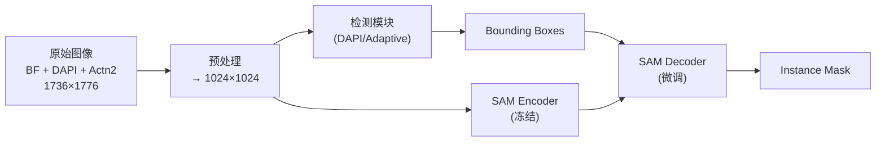
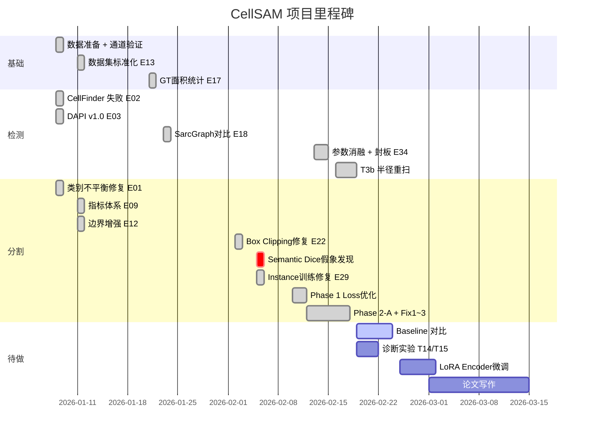

# CellSAM 项目完整进展报告

> **作者**: A2 (Claude)
> **日期**: 2026-02-19
> **项目**: CellSAM — 基于 SAM 的 hiPSC 衍生心肌细胞实例分割
> **数据集**: Allen Institute hiPSC-CM, 478 张图像 (train 334 / val 71 / test 73)

---

## 一、项目整体架构



**核心思路**: CellSAM 原始模型在通用细胞上训练，无法直接识别心肌细胞 (PQ=0)。我们的工作分两个平行方向：
1. **检测方向**: 用 DAPI 核染色替代 CellFinder，为 SAM 提供 box prompt
2. **分割方向**: 微调 SAM Decoder，让模型学习心肌细胞的不规则边界

**参考**: Allen 实验室自身使用 DeepLabV3 (Dice>0.85) + CellProfiler (Rand>0.92) 处理心肌细胞，我们的方案基于 SAM 架构、以 box prompt 驱动实例分割。

---

## 二、实验全记录

### 2.1 方向一：DAPI 检测方案演进

> 目标：从 DAPI 核染色通道定位心肌细胞，为 SAM 生成 bounding box prompt

| 阶段 | 实验 | 日期 | 做了什么 | 关键结果 | 结论 |
|------|------|------|---------|---------|------|
| **起点** | E02 | 01-08 | 测试 CellSAM 自带的 CellFinder (AnchorDETR) | F1=**0.012** | ❌ 完全失败，CellFinder 只认小圆细胞 |
| **v1.0** | E03 | 01-08 | 开发 DAPI 核检测方案: Otsu 阈值 + 形态学 + 面积过滤 (500-15000) + 双核合并 (100px 固定距离) + 边缘排除 (30px) | F1=**0.750** (+62×) | ✅ DAPI 方案可行 |
| **管线集成** | E04/E05 | 01-09 | 把 DAPI 检测接入 SAM 分割管线，像素级→实例级 mask (每个细胞唯一 ID + binary_closing + fill_holes) | Dice 0.58→**0.71** | ✅ 实例级 mask 有效 |
| **v1.2** | E06 | 01-11 | 尝试分水岭分离粘连核 (distance_transform + peak_local_max + watershed + circularity 过滤) | F1=**0.34** (-0.41) | ❌ 心肌细胞核不规则，分水岭过度分割 |
| **v1.3** | E14 | 01-14 | 核-细胞轴向对齐分析 (仅 50% 对齐 @30°) → 各向异性框扩展: 椭圆核长轴 5.0×, 短轴 3.0× | Dice **+3.3%** | ✅ 椭圆核沿长轴多扩展 |
| **v2.0** | E18 | 01-23 | 两个新功能: ① Actn2 覆盖率过滤 (非心肌细胞排除) ② **Z-线 Adaptive 方案**: blob_log 检测 Z-线 → DBSCAN 聚类 → 自适应框。SarcGraph vs DAPI 对比 | SarcGraph F1=0.351, DAPI F1=0.277 | ✅ SarcGraph Precision 更高 (+4.9%)，DAPI Recall 更高 (+12.8%) |
| **v4.0** | E19 | 01-26 | 数据驱动参数精确化: GT 极小核分析 (有效核>3000px), 边缘排除率统计 (100px 排除 5.6%), 双核间距分布 (Mean=161px, P75=160px) → edge=100px, merge=1.5×直径 | 参数精确化 | ✅ GT 统计指导 |
| **消融锁定** | E20 | 01-30 | DAPI Only vs Adaptive 正面对比 (20 样本). Adaptive Precision=0.311, F1=0.300 → 误检严重 | DAPI F1=0.765 >> Adaptive F1=0.300 | ✅ DAPI 方案胜出 |
| **Bug 修复** | E23 | 02-02 | 修复 DAPI 数据加载 uint8 截断 bug (uint16 数据被截断到 0-255) | F1 0→**78%** | 🔧 关键 bug |
| **v5.0** | — | 02-05 | 发现图像分辨率记录错误 (文档 1608×1608, 实际 **1736×1776**), 缩放系数 0.4055→0.340, 所有面积/距离参数全面重算 | 参数修正: min=200, max=10000, margin=32, radius=256 | 🔧 修正 |
| **联合消融** | E34b | 02-14 | 在 val(71) 联合调 edge_margin/size_ratio/merge_coeff | 最优 F1=**0.8106** | ✅ edge=20, ratio=2.5, merge=1.4 |
| **Test 封板** | E34 | 02-14 | 在 test(73) 单次评估，锁定最终参数 (val 调参→test 单次，防止 test 泄漏) | DAPI F1=**0.8033**, Adaptive F1=0.7502 | ✅ 参数封板 |
| **补充诊断** | T3/T3b | 02-16~19 | Adaptive 退化诊断: B2/B3 不敏感因为 zline 饱和 (mean_zlines≈1425). 半径重扫 80-180 | Adaptive 最优 F1=0.7800 (radius=160) | ✅ zline 饱和确认 |

**检测方向总结**:

```
CellFinder F1=0.012 → DAPI v1 F1=0.75 → Bug修复 F1=0.78 → E34b F1=0.81 → test封板 F1=0.80
                       (+62×)               (+4%)              (+4%)
```

最终参数 (test 封板):

| 参数 | 值 | 来源 |
|------|-----|------|
| min_nucleus_area | 1500 | E34 val 消融 |
| max_nucleus_area | 20000 | E34 val 消融 |
| use_relative_distance | True (1.2×直径) | E19 数据驱动 |
| merge_coeff | 1.4 | E34b 联合消融 |
| size_ratio_threshold | 2.5 | E34b |
| edge_margin | 20 | E34b |

---

### 2.2 方向二：SAM 模型微调

> 目标：微调 SAM Decoder，使其能正确分割心肌细胞的不规则形状

| 阶段 | 实验 | 日期 | 做了什么 | 关键结果 | 结论 |
|------|------|------|---------|---------|------|
| **基线** | E33 | 02-06 | CellSAM 原始权重 + GT boxes (Oracle) | PQ=**0.000**, BM-Dice=0.111 | ⚠️ 预训练模型完全不行 (TP=0, FP=10.1/样本, 域外不匹配) |
| **类别不平衡** | E01 | 01-08 | 训练修复: 损失仅在扩展 box 内计算 (非全图), 动态 pos_weight=min(n_neg/n_pos, 10), 组合损失=0.5×Dice+0.5×BCE. lr=1e-4, epochs=50, batch=4, 50 样本 | Val Dice 0→**0.52** | ✅ 模型开始预测 |
| **指标体系** | E09 | 01-11 | 实现四层验证指标: PQ (SQ×RQ), AJI, Rand Index, Boundary IoU, HD95. 测试 5 样本 | PQ@0.5=**0.000**, AJI=0.102, Max IoU 仅 0.05-0.22 | ⚠️ 发现"高 Dice + 低 PQ" (像素总体对但每个细胞边界偏差大), 建议增加 Boundary Loss |
| **边界增强** | E12 | 01-11 | 从 E01 模型继续微调. 新增 BoundaryLoss (边缘像素单独计算), 损失=0.7×(Dice+BCE)+0.3×Boundary. lr=**1e-5**, epochs=20, batch=2 | PQ@0.5: 0.024→**0.087** (+265%), Dice: 0.758→**0.822** (+8%), Max IoU: 0.489→0.548 | ✅ 边界损失有效 |
| **数据标准化** | E13 | 01-11 | 固定 Train/Val/Test 划分 (334/71/73, seed=42), 创建统一 `src/train.py` + YAML 配置 + `src/losses/` 模块 | 可复现划分 + 统一入口 | ✅ 后续消融实验基础 |
| **面积统计** | E17 | 01-21 | 全部 478 张图的 GT 细胞面积统计: 5173 cells, Min=6240, **Median=142316**, Max=1026328, P1=40836, P99=513928. 最小值 6240 为标注异常 | 阈值 [40K, 514K] 覆盖 98% | ✅ SizeLoss + 推理过滤参数来源 |
| **多通道探索** | E15a/b | 01-15 | BF 基线 (E15a Dice=0.6472) vs BF+DAPI+Actn2 三通道 (E15b Dice=0.7454). 三通道需要 Semantic Mapper 适配 SAM ViT 的 3ch 输入 | 3ch Dice=0.7454 < E12 | ❌ 多通道反而更差 |
| **E12 确认** | E16 | 01-16 | E12 vs E15b 正式对比 | E12 优 +2.6% | ✅ BF 单通道最佳 |
| **推理修复** | E22 | 02-02 | 发现 SAM 预测 mask 远超 box 2-15× → 训练-推理不一致 (训练只在 box+20% 内算 loss, 推理未裁剪). 修复: 添加 box clipping | PQ@0.3: 0.002→**0.181** (90×), 发现 67% 过分割 | 🔧 关键修复 |
| **集群训练** | E24-E28 | 02-03~04 | 在 ALICE HPC 跑 5 组: E24 BF(A100), E25 Boundary(L4), E26 3ch NoAdapter(L4), E27 3ch Adapter(A100), E28 BF Adapter(A100) | 全部 Semantic Dice ~0.75 (实际 Instance Dice=0.03) | ⚠️ 指标假象 |
| **⚠️ 关键发现** | — | 02-05 | **所有 E01-E28 的训练 target 是 `mask > 0` (Semantic)**，将全部细胞合并为一个 blob。E25 实例分析: Pred area=105129 vs GT=41477, Instance IoU=0.033 | Instance Dice=**0.03** | 🔴 关键转折点 |
| **Instance 修复** | E29 | 02-05 | 修复: ① target = `mask == cell_id` (Instance-level) ② Box clipping ③ Instance Dice 验证. 新增 ContourLoss + GridDistortion. 设计 Phase 1/2 分阶段方案 | PQ=**0.33**, BM-Dice=0.59 | ✅ Instance 训练有效 |
| **Phase 1** 🔑 | P1 | 02-10~11 | Loss 权重重平衡: boundary 0.5→**1.5**, contour OFF→**0.3**, pos_weight 10→**2**. PQ 早停 (patience=15). ALICE L4+A100 双卡训练 | **PQ=0.4641, BM-Dice=0.6954** (Oracle test) | ✅ PQ 较 E29 +44% |
| **Phase 2-A** | P2-A | 02-12+ | 添加 Non-Overlap Loss: L_neighbor (邻居入侵惩罚) + L_overlap (重叠互斥惩罚). 含 computability gating + 归一化 | PQ **退化** | ⚠️ Loss 设计过保守 |
| **P2-A Fix1-3** | — | 02-15~17 | Fix1: 从 P1 微调 (非从头训), Fix2: 延迟介入 (5 epoch 后开始), Fix3: 权重递减 (0.5→0.1) | 均持续退化 | ❌ N/O Loss 过度惩罚正常边界 |

**分割方向总结**:

```
Pretrained PQ=0   →  E01 Dice=0.52  →  E09 发现PQ=0  →  E12 PQ=0.087  →  [E01-E28 Semantic假象]
                                          (指标体系)       (+265%)          2026-02-05 发现
                                                                                    ↓
Phase 1 PQ=0.475  ←  E29 PQ=0.33  ←←←←←←←←←←←←←←←←←←←←←←←←←←←  Instance修复
(+44%, 当前最佳)        (Instance训练)
```

**Phase 1 最终指标 (test 73 锁定)**:

| 指标 | Oracle (GT boxes) | E2E (DAPI 检测框) | Gap |
|------|:--:|:--:|:--:|
| **BM-1to1 Dice** | **0.6954** | 0.5446 | -0.151 |
| **PQ@0.5** | **0.4641** | 0.1719 | -0.292 |
| **AJI** | **0.5195** | 0.3181 | -0.201 |
| Semantic Dice | 0.7566 | 0.6006 | -0.156 |

> Oracle-E2E Gap 主要来自检测质量 (DAPI F1=0.80 不完美)，不是分割能力不足。

### 2.3 关键教训与决策

> 项目中有几个关键转折点需要重点记录:

| 日期 | 决策/发现 | 影响 |
|------|----------|------|
| 01-08 | 放弃 CellFinder，开发 DAPI 检测 | 全新检测管线 |
| 01-09 | 像素级→实例级分割 | 支持 PQ/AJI 等指标 |
| 01-11 | 放弃分水岭 (E06) | 保持简单 Otsu 方案 |
| 01-11 | 采用边界损失 (E12) | PQ +265% |
| **02-05** | **发现 Semantic Dice 假象**，E01-E28 全部失效 | 🔴 重新定义训练 target |
| **02-05** | 发现图像分辨率记录错误 | 所有参数重算 |
| 02-10 | Phase 1 Loss 重平衡 | 当前最优 PQ=0.475 |
| 02-15~17 | P2-A (N/O Loss) 退化，3 轮修复均失败 | N/O Loss 方向暂停 |

---

## 三、核心代码文件

### 3.1 代码架构

```
src/
├── train.py                           # 训练主入口 (Instance-level, PQ 早停)
├── augmented_dataset.py               # 数据加载 (Instance target, box clipping)
├── config/
│   ├── phase1_rebalance_l4.yaml       # ✅ Phase 1 配置 (当前最优)
│   └── phase2a_neighbor_overlap.yaml  # Phase 2-A 配置
├── detection/
│   ├── dapi.py                        # DAPI 核检测 + Adaptive Z-线检测
│   └── profiles.py                    # 参数 profile (runtime_default / locked_eval)
├── inference/
│   ├── core.py                        # 统一推理核心 (InferenceConfig + segment_with_boxes)
│   └── postprocess.py                 # 后处理 (面积过滤/形态学)
├── losses/
│   └── combined.py                    # CombinedLoss v4 (Dice+BCE+Boundary+Contour+Neighbor+Overlap)
├── metrics/
│   └── instance_metrics.py            # 统一指标 (BM-1to1 Dice, PQ, AJI, SQ, RQ)
└── adapters/
    └── channel_adapter.py             # Semantic Channel Adapter (三通道映射)

tools/
├── comprehensive_eval.py              # Oracle 评估 (GT boxes → test 全指标)
├── evaluate_e2e.py                    # E2E 评估 (DAPI 检测 → 分割 → 评估)
├── smoke_test_e2e.py                  # 快速冒烟测试 (默认 30 val 样本)
├── visualize_phase1_napari.py         # ⭐ Napari 分割结果展示
├── compare_boxes_napari.py            # Napari 框对比
├── view_allen_channels_napari.py      # 查看原始图像通道
├── verify_training_config.py          # 训练前配置验证 (⚠️ 每次训练必跑)
├── test_loss_gradients.py             # 梯度检查 (12-test)
└── test_unified_regression.py         # 回归测试 (10-test)

scripts/
├── train_phase2a.sh                   # ALICE L4 SLURM 脚本
└── train_phase2a_a100.sh              # ALICE A100 SLURM 脚本
```

### 3.2 关键命令

```bash
# 训练
python src/train.py --config src/config/phase1_rebalance_l4.yaml

# Oracle 评估 (GT boxes + test 集)
python tools/comprehensive_eval.py

# E2E 评估 (DAPI 检测 + 分割)
python tools/evaluate_e2e.py --checkpoint checkpoints/E_phase1_rebalance_l4/best_model.pt

# 快速冒烟测试
python tools/smoke_test_e2e.py --n_samples 30

# 训练前必须检查
python tools/verify_training_config.py

# 评估分工: smoke_test → 开发迭代 (val 30), comprehensive_eval → 最终锁定 (test 73)
```

---

## 四、Napari 可视化指南

### 4.1 展示最新模型效果

已有脚本 `tools/visualize_phase1_napari.py`，已配置为 **test 集前 5 个样本**：

```bash
conda activate cellsam
python tools/visualize_phase1_napari.py
```

**脚本自动完成**:
1. 加载 Phase 1 最优模型 (`checkpoints/E_phase1_rebalance_l4/best_model.pt`)
2. 取 **test 集前 5 个样本** (确定性，非随机)
3. 对每个样本分别用 **GT 框 / DAPI 核框 / Z-line Adaptive 框** 推理
4. 在 napari 中展示:
   - 3 个图像通道 (BF, DAPI, Actn2)
   - GT 分割 mask (ground truth)
   - 3 种框来源的分割结果 (Seg(GT) / Seg(DAPI) / Seg(Z-line))
   - 框的可视化 (绿色=GT, 橙色=DAPI, 青色=Z-line)

**napari 操作提示**:
- 点击图层左侧👁️切换显示/隐藏
- 切换 `Seg(GT)` / `Seg(DAPI)` 对比 Oracle vs E2E 效果
- 图层名以 `[1]` ~ `[5]` 开头区分不同样本

---

## 五、待办事项汇总

### 5.1 论文必需 (优先级最高)

| 任务 | 内容 | 执行者 | 状态 |
|------|------|--------|------|
| **E-B4** | CellSAM 原版 Oracle 在 test(73) | A2 (Claude) | ⏳ |
| **E-B5** | MedSAM 在 test(73) | A2 | ⏳ |
| **E-B1** | Cellpose (cyto3) 在 test(73) | A2 | ⏳ |
| **E-B2** | StarDist (2D_versatile_fluo) 在 test(73) | A2 | ⏳ |
| **P2-D** | lr=5e-5 消融 (论文消融表) | A1/A2 | ⏳ |
| **P2-E** | epochs=80 消融 (论文消融表) | A1/A2 | ⏳ |

### 5.2 短期技术任务 (顺序灵活)

| 任务 | 内容 | 执行者 | 状态 |
|------|------|--------|------|
| **T11 LoRA** | Encoder 加 LoRA (rank=4~8), 尝试突破 PQ=0.50 | A2 | ⏳ |
| **T13** | 评估 E30/E32 Adapter Instance checkpoint | A1/A2 | ⏳ |
| **T14** 🆕 | P2-B 诊断 A: 量化 P1 的 conflict_rate + intrusion_rate | A1/A2 | ⏳ |
| **T15** 🆕 | P2-B 诊断 B: Oracle 冲突消解 → PQ delta 判断冲突是否是瓶颈 | A1/A2 | ⏳ |

> **P2-B 决策逻辑**: T14/T15 诊断后, 若 PQ delta > 0.02 → 做 P2-B 全局版; 若 delta ≈ 0 → 跳过 P2-B

### 5.3 长期/可选

| 任务 | 内容 | 执行者 |
|------|------|--------|
| T7 | BF-only vs 三通道 Adapter 对比 | A1 |
| T8 | 推理冲突区域高级策略 (Watershed/CRF) | A2 |
| T9/T10 | 文档审核 (10 篇文档逐个对照源码) | A1 |

---

## 六、已确认事项 ✅

| # | 问题 | 决定 |
|---|------|------|
| 1 | LoRA vs baseline 哪个先做 | **顺序灵活**，哪个方便先做哪个 |
| 2 | P2-B (N/O Loss) 是否继续 | **暂停**，先做诊断实验 T14+T15 再决定；如果做，用全局计算版本 |
| 3 | napari 展示数据 | 使用 **test 集前 5 个样本** (已修改脚本) |
| 4 | 本地 conda 环境 | ✅ `conda activate cellsam` 可用 |

---

## 七、项目里程碑时间线


